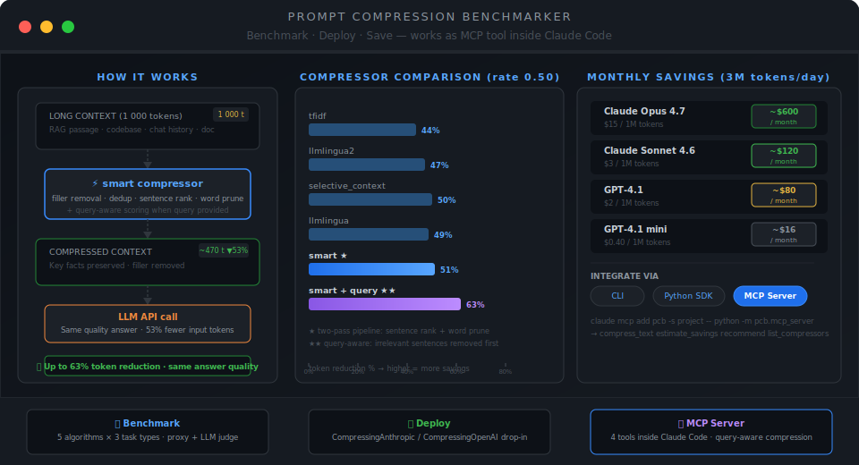

# Prompt Compression Benchmarker (pcb)

[](https://www.python.org/downloads/)
[](LICENSE)
[](https://marketplace.visualstudio.com/items?itemName=NeoResearchInc.heyneo)
[](https://marketplace.cursorapi.com/items/?itemName=NeoResearchInc.heyneo)

> Made autonomously using **[NEO — Your Autonomous AI Engineering Agent](https://heyneo.com)**

Benchmark every major prompt compression algorithm against your actual workload — then deploy the winner as a drop-in wrapper around your Anthropic or OpenAI client. Cuts input token costs by 35–63% with measurable quality tracking.



```
pcb run --daily-tokens 3000000 --cost-model claude-sonnet-4-6
```

```
                          RAG
 Compressor          Token Reduc %  Proxy Score  Proxy Drop %   ms
 no_compression           0.0%        0.2983         0.0%      0.3
 tfidf ★                 40.1%        0.2519        +16.5%     12.1
 selective_context        56.9%        0.1874        +34.4%      8.3
 llmlingua                53.6%        0.2182        +28.1%      9.7
 llmlingua2               45.0%        0.2204        +27.3%     11.2

 Monthly Cost Projection  claude-sonnet-4-6 · $3/1M · 3M tokens/day
 tfidf             38.3% reduction   $103/mo saved   $1,240/yr
 selective_context 57.5% reduction   $155/mo saved   $1,863/yr
 llmlingua2        43.6% reduction   $118/mo saved   $1,413/yr
```

---

## What it does

Most LLM cost comes from input tokens — the long documents, codebases, or conversation histories you send as context. **pcb** answers two questions:

1. **Which compression algorithm preserves the most quality at a given token budget?** (benchmark mode)
2. **How much money does that save at your actual call volume?** (cost projection)

Then it gives you a one-line wrapper to deploy the answer.

---

## Installation

**From source:**

```bash
git clone https://github.com/your-org/prompt-compression-benchmarker
cd prompt-compression-benchmarker
pip install .
```

**From PyPI (once published):**

```bash
pip install prompt-compression-benchmarker
```

Requires Python 3.9+. No GPU required. Core dependencies: `tiktoken`, `scikit-learn`, `rouge-score`, `rank-bm25`, `typer`, `rich`.

```bash
# Verify
pcb --help

# Optional extras
pip install "prompt-compression-benchmarker[anthropic]"   # SDK wrapper for Anthropic
pip install "prompt-compression-benchmarker[openai]"      # SDK wrapper for OpenAI
pip install "prompt-compression-benchmarker[mcp]"         # MCP server for Claude Code
pip install "prompt-compression-benchmarker[all]"         # Everything
```

---

## Quick start

### 1. Run the benchmark

```bash
# All compressors × all task types, bundled sample data — no setup needed
pcb run

# Target a specific task with cost projection
pcb run --task rag --max-samples 20 --daily-tokens 2000000 --cost-model claude-sonnet-4-6

# Add LLM-as-judge for deeper quality scoring (requires OpenRouter API key)
export OPENROUTER_API_KEY=sk-or-...
pcb run --llm-judge --judge-model claude-sonnet-4-6 --max-samples 10
```

### 2. Compress a file directly

```bash
# Compress from a file or stdin, output to stdout
pcb compress context.txt --compressor llmlingua2 --rate 0.45 --stats

# Pipe it into any script
cat rag_context.txt | pcb compress | python send_to_claude.py

# Save compressed output
pcb compress context.txt -o compressed.txt --stats
```

### 3. Deploy the winner

```python
from pcb.middleware import CompressingAnthropic

# Drop-in replacement for anthropic.Anthropic()
client = CompressingAnthropic(compressor="llmlingua2", rate=0.45)

response = client.messages.create(
    model="claude-opus-4-7",
    messages=[{"role": "user", "content": very_long_document}],
    max_tokens=1024,
)

print(client.stats)  # CompressionStats(calls=47, tokens_saved=21,800, reduction=44.8%)
```

---

## Understanding the results

### Benchmark table columns

| Column | What it means |
|---|---|
| **Token Reduc %** | Fraction of input tokens removed at the target compression rate |
| **Proxy Score** | Task-specific automated quality metric (F1/ROUGE-L/BM25) vs. no-compression baseline |
| **Proxy Drop %** | Quality change — cyan (negative) means compression improved the metric |
| **LLM Score** | 0–1 judge score from a real model (`--llm-judge` only) |
| **ms** | Compression latency in milliseconds |
| **★** | Pareto-optimal — best token savings given quality drop below 20% |

### Quality drop color coding

```
cyan   = negative drop (compression improved the metric — noise removal)
green  = < 5% drop    (effectively lossless)
yellow = 5–15% drop   (acceptable for most use cases)
red    = ≥ 15% drop   (significant information loss)
```

### Why use the LLM judge?

The proxy score (F1, ROUGE, BM25) is fast and free but mechanical. The LLM judge calls a real model to evaluate whether the compressed context still supports the correct answer — it reveals things proxy metrics miss:

```
RAG task, 5 samples, LLM judge = claude-sonnet-4-6

Compressor           Proxy Drop %   LLM Score   LLM Drop %
no_compression           0.0%         0.94         0.0%
tfidf                  +23.7%         0.40        -57.4%    ← proxy hid the severity
llmlingua2             +29.9%         0.70        -25.5%    ← much better than proxy suggested
selective_context      +37.6%         0.14        -85.1%    ← dangerous despite high compression
```

**Rule of thumb:** use proxy scores to compare many configs quickly, then LLM-judge the top 2–3 before deploying.

---

## Compressors

| Name | Algorithm | Best for |
|---|---|---|
| `tfidf` | TF-IDF sentence scoring — keeps highest-scoring sentences | General documents, news, factual passages |
| `selective_context` | Greedy token-budget selection from the front | Structured documents where key info is front-loaded |
| `llmlingua` | Sentence-level coarse pruning | Long narratives, transcripts, multi-turn conversations |
| `llmlingua2` | Word-level stopword and low-content token pruning | Code, technical docs, RAG with named entities |
| `no_compression` | Passthrough baseline | Quality ceiling reference |

### Choosing a compressor

- **RAG:** `llmlingua2` at rate 0.40 — preserves named entities and key facts better than sentence-dropping
- **Summarization:** `llmlingua` at rate 0.45 — sentence-level pruning maintains structural coverage
- **Code contexts:** `llmlingua2` at rate 0.35 — keeps imports, identifiers, type names; removes boilerplate
- **General chat:** `tfidf` at rate 0.40 — safe default, fast, reliable

### Target compression rate

`--rate` is the fraction of tokens to remove. `0.45` means keep 55% of tokens.

| Rate | Tokens kept | Typical quality drop | Savings at 3M tokens/day on Sonnet |
|---|---|---|---|
| 0.25 | 75% | < 5% | ~$67/mo |
| 0.40 | 60% | 5–15% | ~$108/mo |
| 0.50 | 50% | 10–25% | ~$135/mo |
| 0.60 | 40% | 20–40% | ~$162/mo |

---

## Cost savings — the real numbers

Compression saves money on **input tokens only**. Output tokens are unchanged.

### At 3M input tokens per day

| Model | Rate | Monthly base cost | Best compressor saves |
|---|---|---|---|
| Claude Opus 4.7 ($15/1M) | 0.45 | $1,350/mo | **~$600/mo** |
| Claude Sonnet 4.6 ($3/1M) | 0.45 | $270/mo | ~$120/mo |
| GPT-4.1 ($2/1M) | 0.45 | $180/mo | ~$80/mo |
| GPT-4.1-mini ($0.40/1M) | 0.45 | $36/mo | ~$16/mo |
| DeepSeek V3.2 ($0.27/1M) | 0.45 | $24/mo | ~$11/mo |

**Compression is most valuable on premium models.** On DeepSeek or GPT-4.1-mini, the savings are too small to justify the complexity — use it only if you're hitting context window limits.

```bash
# Check your own workload
pcb run --max-samples 10 --daily-tokens 5000000 --cost-model claude-opus-4-7
```

---

## Deploy: Python SDK wrappers

### Anthropic

```python
from pcb.middleware import CompressingAnthropic

client = CompressingAnthropic(
    compressor="llmlingua2",
    rate=0.45,
    verbose=True,
)

response = client.messages.create(
    model="claude-opus-4-7",
    messages=[{"role": "user", "content": very_long_document}],
    max_tokens=1024,
)

# Cumulative stats
print(client.stats)
# CompressionStats(calls=47, tokens_saved=21,800, reduction=44.8%)

# Estimate monthly savings
print(client.stats.monthly_savings_usd(price_per_million=15.0, daily_calls_estimate=2000))
# 588.0
```

### OpenAI (Chat Completions + Codex Responses API)

```python
from pcb.middleware import CompressingOpenAI

client = CompressingOpenAI(compressor="tfidf", rate=0.40)

# Chat Completions API — unchanged
response = client.chat.completions.create(
    model="gpt-4.1",
    messages=[{"role": "user", "content": long_context}]
)

# Responses API (Codex / o-series)
response = client.responses.create(
    model="codex-mini-latest",
    input=long_codebase_context,
    reasoning={"effort": "high"}
)
```

### What gets compressed

By default, only `"user"` role messages over 100 tokens are compressed. System prompts and assistant history are passed through unchanged.

```python
client = CompressingAnthropic(
    compressor="llmlingua2",
    rate=0.45,
    compress_roles=("user", "system"),  # also compress system prompt
)
```

---

## Claude Code integration (MCP)

pcb ships an MCP server that adds four compression tools directly into Claude Code conversations.

### Setup

```bash
# Add to the current project
claude mcp add pcb -s project -- python -m pcb.mcp_server

# Or add to all your projects
claude mcp add pcb -s user -- python -m pcb.mcp_server
```

Or drop `.mcp.json` into any project root:

```json
{
  "mcpServers": {
    "pcb": {
      "type": "stdio",
      "command": "python",
      "args": ["-m", "pcb.mcp_server"]
    }
  }
}
```

### Available tools

Once connected, ask Claude:

> "Compress this RAG context before sending it to the model"  
> "Estimate how much I'd save compressing my prompts on claude-opus-4-7 at 2000 calls/day"  
> "What compressor should I use for my coding assistant at 90% quality floor?"

| Tool | Input | Output |
|---|---|---|
| `compress_text` | text, compressor, rate | compressed_text, token stats |
| `estimate_savings` | text, model, daily_calls, compressor, rate | monthly/annual USD savings |
| `recommend` | task_type, quality_floor | best compressor + rate + reasoning |
| `list_compressors` | — | all algorithms with descriptions |

### OpenAI Codex (Agents SDK)

```python
from agents import Agent, Runner
from agents.mcp import MCPServerStdio
import asyncio

async def main():
    async with MCPServerStdio(
        name="pcb",
        params={"command": "python", "args": ["-m", "pcb.mcp_server"]},
    ) as pcb_server:
        agent = Agent(
            name="CostAwareAssistant",
            model="codex-mini-latest",
            mcp_servers=[pcb_server],
        )
        result = await Runner.run(
            agent,
            "Compress this codebase context and estimate savings: " + codebase_context
        )
        print(result.final_output)

asyncio.run(main())
```

---

## Bring your own data

Data is JSONL — one JSON object per line.

```bash
pcb show-schema rag
pcb show-schema summarization
pcb show-schema coding
```

### RAG schema

```json
{
  "id": "my_001",
  "context": "<passage 300–1500 tokens>",
  "question": "<specific question requiring the full context>",
  "answer": "<short, precise answer string>"
}
```

### Summarization schema

```json
{
  "id": "my_001",
  "article": "<article or document 300–800 tokens>",
  "summary": "<2–3 sentence reference summary>"
}
```

### Coding schema

```json
{
  "id": "my_001",
  "context": "<imports, helpers, type definitions — 400–800 tokens>",
  "docstring": "<description of the function to implement>",
  "solution": "<correct Python implementation>"
}
```

### Running on your data

```bash
pcb run --data-dir ./my_data --task rag --max-samples 50

# Compare specific compressors
pcb run --data-dir ./my_data --compressor tfidf --compressor llmlingua2

# Export results
pcb run --data-dir ./my_data --output results.json
pcb run --data-dir ./my_data --output results.csv
pcb run --data-dir ./my_data --output results.html
```

---

## Workflow: benchmark to production

**Step 1 — Benchmark on your actual data**

```bash
pcb run --data-dir ./my_data --max-samples 50 --task rag \
        --daily-tokens 2000000 --cost-model claude-opus-4-7 \
        --output benchmark.json
```

**Step 2 — LLM-judge the top candidates**

```bash
pcb run --data-dir ./my_data --compressor tfidf --compressor llmlingua2 \
        --llm-judge --judge-model claude-sonnet-4-6 --max-samples 30
```

**Step 3 — Deploy the winner**

```python
from pcb.middleware import CompressingAnthropic

client = CompressingAnthropic(compressor="llmlingua2", rate=0.40)
# Everything else in your codebase stays the same
```

**Step 4 — Monitor in production**

```python
if client.stats.calls % 1000 == 0:
    logger.info(
        "pcb savings: calls=%d saved=%d tokens (%.1f%%) est_monthly=$%.0f",
        client.stats.calls,
        client.stats.tokens_saved,
        client.stats.reduction_pct,
        client.stats.monthly_savings_usd(price_per_million=15.0, daily_calls_estimate=2000),
    )
```

---

## CLI reference

### `pcb run` — benchmark

```
Options:
  -c, --compressor TEXT       Compressor to include (repeat for multiple). Default: all five.
  -t, --task TEXT             Task type: rag, summarization, coding (repeat for multiple).
  -n, --max-samples INT       Max samples per task.
  -r, --rate FLOAT            Target compression rate 0.0–1.0. Default: 0.5
  -d, --data-dir PATH         Directory with *_samples.jsonl files.
  -o, --output PATH           Save report as .json, .csv, or .html.
  -j, --llm-judge             Enable LLM-as-judge scoring via OpenRouter.
  -m, --judge-model TEXT      Model for LLM judge. Default: claude-sonnet-4-6.
      --openrouter-key TEXT   OpenRouter API key (or set OPENROUTER_API_KEY).
      --daily-tokens INT      Daily token volume for cost projection.
      --cost-model TEXT       Model name for cost lookup (e.g. claude-opus-4-7).
      --token-price FLOAT     Manual price override in $/1M tokens.
```

### `pcb compress` — compress text

```
Arguments:
  [INPUT_FILE]                File to compress. Reads stdin if omitted.

Options:
  -c, --compressor TEXT       Algorithm. Default: tfidf.
  -r, --rate FLOAT            Fraction to remove. Default: 0.45.
  -o, --output PATH           Write to file instead of stdout.
  -s, --stats                 Print token stats to stderr.
```

### Other commands

```bash
pcb list-compressors          # Show all algorithms
pcb list-models               # Show 65+ supported LLM judge models
pcb show-schema rag           # Show JSONL schema for a task type
```

---

## Output formats

### JSON — full detail per sample

```bash
pcb run --output results.json
```

### CSV — one row per compressor × task

```bash
pcb run --output results.csv
```

Columns: `compressor, task, avg_token_reduction_pct, avg_quality_score, avg_quality_drop_pct, avg_llm_score, avg_llm_drop_pct, avg_latency_ms, num_samples`

### HTML — shareable visual report

```bash
pcb run --output results.html
# Open in any browser — Chart.js scatter plots, dark theme, Pareto highlights
```

---

## When NOT to use compression

- **Short prompts (< 200 tokens):** pcb skips these automatically — overhead exceeds savings
- **Cheap models (< $0.50/1M):** DeepSeek, Gemini Flash, GPT-4.1-mini — savings too small
- **High-precision tasks:** Legal review, medical diagnosis — verify your quality floor with `--llm-judge` first
- **Output-bottlenecked workloads:** Compression only affects input tokens

---

## Project structure

```
src/pcb/
├── cli.py                      # Typer CLI — all commands
├── config.py                   # Pydantic config and model pricing table
├── runner.py                   # Benchmark orchestration + BenchmarkReport
├── mcp_server.py               # FastMCP server for Claude Code / Codex
├── compressors/
│   ├── tfidf.py                # TF-IDF sentence scoring
│   ├── selective_context.py    # Greedy token-budget selection
│   ├── llmlingua.py            # Sentence-level coarse pruning
│   └── no_compression.py       # Passthrough baseline
├── tasks/
│   ├── rag.py                  # F1/EM/context-recall evaluator
│   ├── summarization.py        # ROUGE-L evaluator
│   └── coding.py               # BM25 + identifier preservation
├── evaluators/
│   └── llm_judge.py            # OpenRouter LLM-as-judge (65+ models)
├── reporters/
│   ├── terminal.py             # Rich terminal tables
│   ├── json_reporter.py        # JSON output
│   ├── csv_reporter.py         # CSV output
│   └── html_reporter.py        # Chart.js HTML report
├── middleware/
│   ├── anthropic_client.py     # CompressingAnthropic drop-in wrapper
│   └── openai_client.py        # CompressingOpenAI drop-in wrapper
└── data/
    ├── rag_samples.jsonl        # 20 real-world factual passages (400–450 tokens)
    ├── summarization_samples.jsonl  # 10 real news-style articles
    └── coding_samples.jsonl     # 10 real Python code contexts (370–800 tokens)
```

---

## License

MIT

---

<div align="center">

Made autonomously using **[NEO — Your Autonomous AI Engineering Agent](https://heyneo.com)**

[](https://marketplace.visualstudio.com/items?itemName=NeoResearchInc.heyneo)
[](https://marketplace.cursorapi.com/items/?itemName=NeoResearchInc.heyneo)

</div>
